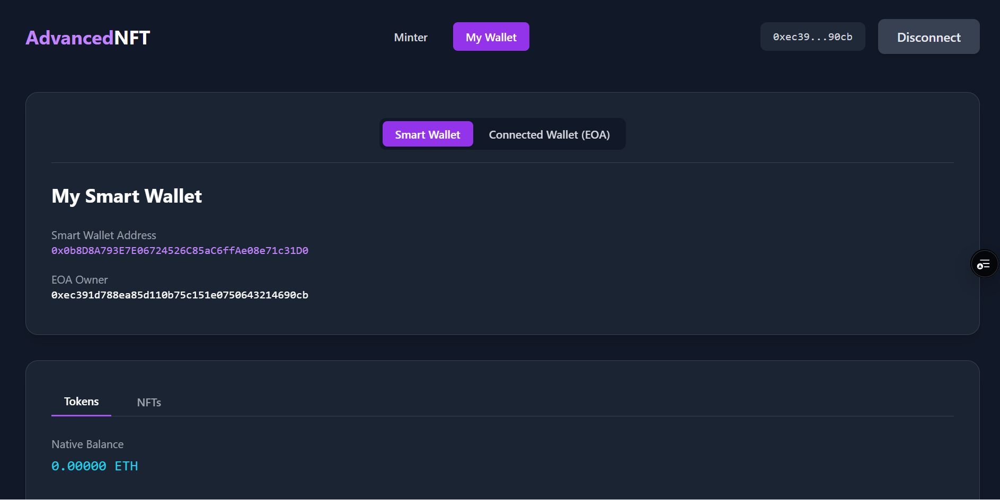

# Advanced Full-Stack NFT Project + Built From-Scratch Wallet

[](https://nft-smart-contract-wallet-amhs1i4al-devds-projects-0114b344.vercel.app/)
[](https://opensource.org/licenses/MIT)

<p >
  
  

</p>
<p align="center"><em>[Left: full stack dApp demo; Right: profit splitting among 2 contributors]</em></p>
This is a comprehensive, full-stack NFT project designed to serve as a professional portfolio piece. It demonstrates a deep understanding of advanced blockchain concepts, secure smart contract development, and modern dApp architecture, including a gasless user experience via a custom meta-transaction relayer.
<table>
  <tr>
    <td></td>
    <td></td>
    <td></td>
  </tr>
  <tr>
    <td></td>
    <td></td>
    <td></td>
  </tr>
</table>

---

## Core Features

-   **Gasless User Experience:** Users can create a personal smart contract wallet and mint NFTs without paying for gas, thanks to a custom-built, EIP-712 compliant meta-transaction relayer.
-   **Personal Smart Contract Wallets:** Deploys a unique smart contract wallet for each user via a secure factory pattern, enabling meta-transactions and laying the groundwork for account abstraction.
-   **Fair & Secure Minting:** Employs a commit-reveal scheme with a configurable delay to prevent front-running and guarantee a fair minting experience.
-   **Secure Contributor Payouts:** Implements a battle-tested, pull-based payment splitter for distributing minting proceeds, ensuring contributors can securely and reliably withdraw their share of the funds at any time.
-   **Multi-Asset Portfolio Dashboard:** A feature-rich "My Wallet" page that acts as a true portfolio viewer, using a resilient, **rate-limit-aware** Etherscan API client to display a wallet's balance of ETH, all **ERC20** tokens, and all **ERC-721 & ERC-1155** NFTs.
-   **100% On-Chain Generative Art:** NFT artwork is generated and stored directly on the blockchain as an SVG, making the asset entirely self-contained and permanent.
-   **Gas-Efficient Airdrop System:** Utilizes a Merkle tree to manage the presale whitelist, allowing for a virtually unlimited number of users with minimal on-chain costs.
-   **From-Scratch Cryptography Demo:** Includes a standalone `wallet.js` utility that manually performs all the steps of a raw Ethereum transaction, proving a first-principles understanding of the underlying cryptography.

---

## Skills & Technologies Showcase

| Technology/Concept | Skills Demonstrated |
| :--- | :--- |
| **Smart Contracts (Solidity)** | **Advanced Contract Architecture:** Secure, gas-efficient, and feature-rich smart contract development using **OpenZeppelin Contracts**. |
| &nbsp;&nbsp;&nbsp;↳ Commit-Reveal Scheme | **Fair Minting & Front-Running Prevention:** A two-step minting process to ensure fairness and unpredictability in a public sale. |
| &nbsp;&nbsp;&nbsp;↳ Merkle Tree Airdrop | **Gas Efficiency & Scalability:** A system to manage a large presale whitelist on-chain with minimal gas costs, proving a deep understanding of data structures. |
| &nbsp;&nbsp;&nbsp;↳ On-Chain Art & Metadata | **Decentralization & Permanence:** Generation and storage of generative SVG artwork and metadata directly on the blockchain. |
| &nbsp;&nbsp;&nbsp;↳ Smart Contract Wallets | **Account Abstraction Principles:** A factory pattern for deploying personal smart contract wallets, enabling meta-transactions. |
| **Backend (Node.js/Vercel)** | **Full-Stack & Serverless Architecture:** A robust backend service deployed to a modern, scalable **serverless** platform (Vercel). |
| &nbsp;&nbsp;&nbsp;↳ Meta-Transaction Relayer | **Gasless User Experience:** A custom relayer that sponsors gas fees by securely accepting and broadcasting signed, off-chain EIP-712 messages. |
| **Frontend (React/Vite/Ethers.js)**| **Modern & Responsive dApp Development:** A polished, user-friendly, and performant decentralized application. |
| &nbsp;&nbsp;&nbsp;↳ Multi-Asset Portfolio | **Resilient API Integration:** A wallet dashboard that uses a **throttled, auto-retry API client** to discover and display a complete portfolio of ETH, ERC20, **ERC-721, and ERC-1155** assets. |
| **DevOps & Tooling (Hardhat)** | **Professional Development Environment:** Mastery of the industry-standard toolchain for Ethereum development. |
| &nbsp;&nbsp;&nbsp;↳ Advanced Scripting | **Automation & Tooling:** A suite of robust scripts for deployment, state management, and end-to-end user journey simulations. |
| **Cryptography (From Scratch)** | **First-Principles Understanding:** A low-level `wallet.js` utility that proves a deep understanding of core Ethereum cryptography by manually signing and broadcasting raw transactions. |

---

## Deep Dive: Key Technical Features

### 1. Gasless Meta-Transactions & Smart Wallets

This project implements a meta-transaction system to provide a "gasless" experience.
-   **User Action:** The user signs a structured EIP-712 message representing their desired transaction (e.g., "mint an NFT"). This is a cryptographic signature and is free.
-   **Relayer Action:** This signed message is sent to a Node.js serverless function running on Vercel. The relayer wraps this message in a real Ethereum transaction and pays the gas fee to submit it to the blockchain.
-   **Smart Contract Wallet:** The user's personal `SimpleWallet.sol` contract receives the transaction. It uses cryptography (`ecrecover`) to verify that the message was genuinely signed by the wallet's owner before executing the action.

### 2. Commit-Reveal Minting Scheme

To prevent front-running and ensure a fair mint, a two-step process is used:
1.  **Commit:** A user generates a secret `bytes32` value locally. They send a transaction containing the *hash* of this secret to the smart contract, along with the mint payment. This "commits" their intent to mint without revealing any details.
2.  **Reveal:** After a configurable delay (e.g., 10 blocks), the user sends a second transaction containing the original secret. The contract hashes this secret and verifies that it matches the one committed earlier. If it matches, the NFT is minted. This prevents miners or other users from predicting the outcome of the generative art.

### 3. 100% On-Chain Generative Art

The NFT's artwork and metadata are generated and stored directly on the blockchain.
-   **`tokenSVG()`:** This function in `AdvancedNFT.sol` uses the `tokenId`, `minter` address, and `block.timestamp` as sources of pseudo-randomness to generate a unique SVG image string.
-   **`tokenURI()`:** This function generates a Base64 encoded JSON metadata object, which includes the name, description, and the SVG image data. This is compliant with the ERC-721 metadata standard and ensures the NFT is entirely self-contained and permanent.

### 4. Secure Contributor Payouts (Manual Payment Splitter)

This project ensures that revenue from NFT sales is distributed to contributors securely and transparently. Instead of a potentially risky `withdraw` function that pushes funds, it uses a manual, pull-based payment system inspired by OpenZeppelin's `PaymentSplitter` contract.

-   **On-Chain Accounting:** The contract tracks the total ETH received and how much has been released to each contributor based on their pre-defined shares.
-   **Pull-Based Withdrawals:** Each contributor must call a `release(address)` function to "pull" their share of the funds. This is significantly safer than push-based systems, as it prevents re-entrancy attacks and issues with recipients that cannot accept ETH (e.g., a smart contract with no `receive` function).
-   **Fair & Accurate:** Payouts are calculated based on the contract's total current ETH balance and each contributor's shares, ensuring fair and accurate distribution of all proceeds.

---

## Getting Started (Local Development)

This guide covers setting up and running the complete full-stack application on your local machine for development and testing.

### Prerequisites

-   [Node.js](https://nodejs.org/en/) (v18 or later)
-   [NPM](https://www.npmjs.com/) (comes with Node.js)
-   [MetaMask](https://metamask.io/) browser extension

### Step 1: Initial Project Setup (One-Time)

1.  **Clone the Repository:**
    ```bash
    git clone <repo-url>
    cd <repo-folder>
    ```
2.  **Install Dependencies:**
    ```bash
    npm install
    ```
3.  **Configure Environment Variables:**
    -   Copy the example environment file: `cp .env.example .env`
    -   Open the newly created `.env` file. For local development, the default placeholder keys are sufficient.

### Step 2: Running the Full Stack (3 Terminals)

For local development, you'll need three separate terminals running concurrently.

1.  **Terminal 1: Start Local Blockchain** ⛓️
    ```bash
    npx hardhat node
    ```
    This command starts a local Hardhat blockchain. It will print a list of 20 pre-funded test accounts.
    **➡️ Action:** Copy the **Private Key** for **Account #0**.

2.  **Terminal 2: Deploy Smart Contracts** 📝
    ```bash
    npm run deploy
    ```
    This script compiles your contracts and deploys them to the local Hardhat network from Terminal 1.
    **➡️ Action:** This creates all necessary artifacts, including `deployed-addresses.json` and the frontend `.env.local` file.

3.  **Terminal 3: Start Frontend & API Relayer** 🚀
    This command starts a local server that perfectly simulates the Vercel environment, running both the Vite frontend and the serverless API functions together.
    ```bash
    npm run dev:vercel
    ```
    **➡️ Action:** Open the URL it provides (e.g., `http://localhost:3000`).

### Step 3: MetaMask Configuration

-   **Add Network:** Add a new network in MetaMask with the following details:
    -   **Network Name:** `Hardhat Local`
    -   **RPC URL:** `http://127.0.0.1:8545`
    -   **Chain ID:** `1337`
-   **Import Account:** Import **Account #0** into MetaMask using the private key you copied from Terminal 1. This account is the contract owner and is automatically on the airdrop whitelist.

---

## Local User Journeys (End-to-End Testing)

With the local environment running, you can now test every feature of the application.

### Journey 1: Standard Mint (User Pays Gas)

1.  **Set Sale State:** In a **new terminal**, run: `npm run sale:public`
2.  **Connect & Mint:**
    -   On the dApp website, click **"Connect Wallet"**.
    -   On the "Minter" page, click **"Generate Secure Secret"**.
    -   Click **`Commit with MetaMask (0.01 ETH)`** and **Confirm** in MetaMask.
    -   Click **"Reveal & Mint NFT"** and **Confirm** in MetaMask.
    -   ✅ The "Last Minted NFT" preview will update with your new on-chain art.

### Journey 2: Airdrop Claim (Commit-Reveal)

1.  **Set Sale State:** In a new terminal, run: `npm run sale:presale`
2.  **Connect & Claim:** (Ensure you are connected with Account #0, which is on the whitelist).
    -   The Minter UI will show "Airdrop Claim".
    -   Click **"Generate Secure Secret"** and then **"Commit to Claim Airdrop"**. Confirm in MetaMask (gas only).
    -   Click **"Reveal & Mint NFT"**. Confirm in MetaMask (gas only).
    -   ✅ The NFT will be minted to your wallet.

### Journey 3: The Gasless Experience (Smart Wallet)

1.  **Set Sale State:** Ensure the sale is open (`npm run sale:public`).
2.  **Create Smart Wallet:** Navigate to **"My Wallet"** and click **"Create My Smart Wallet (Gasless)"**. The local API will handle the deployment instantly.
3.  **Fund Smart Wallet:**
    -   Copy your new **"Smart Wallet Address"**.
    -   In MetaMask, send **0.01 ETH** from Account #0 to this address.
4.  **Mint Gaslessly:**
    -   Go to the **"Minter"** page.
    -   Click **"Generate Secure Secret"**.
    -   Click **"Commit Gaslessly via Smart Wallet"**. MetaMask will ask for a **free signature**.
    -   Click **"Reveal & Mint NFT"** and **Sign** the second message.
    -   ✅ Navigate to "My Wallet". The new NFT will appear in the "Smart Wallet" gallery.

### Journey 4: The `wallet.js` Proof of Concept

This script demonstrates the from-scratch wallet by minting an NFT without using `ethers.Wallet`.
1.  **Prerequisites:** Your local environment (Terminals 1 & 2 from Step 2) must be running.
2.  **Configure User:** In your `.env` file, set `USER_PRIVATE_KEY` to the private key for **"Account #3"** from Terminal 1.
3.  **Run Script:** In a new terminal, execute `npm run sim:manual`.
4.  ✅ The script will log its progress, performing the full commit-reveal flow from scratch.

---

## The Definitive Vercel Deployment Guide

Follow these steps to deploy the entire full-stack application (frontend dApp and backend relayer) to a single, live Vercel URL on the Sepolia testnet.

### Step 1: Configure the Presale Whitelist

**This is a critical one-time setup step before your first Sepolia deployment.** The Merkle tree for the presale airdrop is generated from a hardcoded list of addresses.

1.  Open the deployment script: `scripts/0_deploy.js`.
2.  Find the `whitelistAddresses` array (around line 50).
3.  **Replace the placeholder addresses** with the real Ethereum addresses of the users you want to whitelist for the presale.

    ```javascript
    // scripts/0_deploy.js
    const whitelistAddresses = [
        "0xYourFirstWhitelistAddress...",
        "0xAnotherUserAddress...",
        // Add all your whitelisted addresses here
    ];
    ```

### Step 2: Deploy Contracts & Generate Artifacts

1.  **Fund Your Wallet:** Ensure the wallet corresponding to your `PRIVATE_KEY` in `.env` has Sepolia ETH to pay for gas.
2.  **Run the Sepolia Deployment Script:**
    ```bash
    npm run deploy:sepolia
    ```
    This deploys your contracts to Sepolia and generates the critical `api/_ABI.js`, `relayer-artifacts.json`, `deployed-addresses.json`, and `public/merkle-proofs.json` files based on your configured whitelist.

### Step 3: Commit Critical Artifacts to Git

The Vercel build process only has access to files you've committed. This is the most critical step.

1.  **Add the generated files to Git:**
    ```bash
    git add public/merkle-proofs.json deployed-addresses.json relayer-artifacts.json api/_ABI.js
    ```
2.  **Commit and Push:**
    ```bash
    git commit -m "feat: Add artifacts for Sepolia deployment"
    git push
    ```

### Step 4: Link Project and Deploy to Vercel

1.  **Run the Vercel Link Command:** In your project directory, run:
    ```bash
    vercel link
    ```
    Follow the prompts to create a **new Vercel project**. Vercel will automatically detect the Vite frontend and the `/api` directory.
2.  **Run the First Preview Deployment:**
    ```bash
    npm run deploy:vercel
    ```

### Step 5: Configure Environment Variables on Vercel

1.  Go to your project's dashboard on the Vercel website.
2.  Navigate to **Settings -> Environment Variables**.
3.  Add the following secrets. These are essential for the backend relayer and frontend to work.

| Variable Name | Value | Description |
| :--- | :--- | :--- |
| `NETWORK` | `sepolia` | **(Backend)** Tells the relayer which network to use. |
| `SEPOLIA_RPC_URL`| `https://sepolia.infura.io/v3/...` | **(Backend)** Your Sepolia RPC URL. |
| `RELAYER_PRIVATE_KEY`| `0x...` | **(Backend)** The private key for your relayer wallet. **Highly sensitive.** |
| `VITE_SEPOLIA_RPC_URL` | `https://sepolia.infura.io/v3/...`| **(Frontend)** The same RPC URL, exposed to the frontend. |
| `VITE_ETHERSCAN_API_KEY` | `YourEtherscanApiKey`| **(Frontend)** Your Etherscan API key for the portfolio viewer. |

### Step 6: Final Production Deployment

You must re-deploy for the new environment variables to take effect.
```bash
npm run deploy:vercel:prod
```

### Step 7: Open the Sale on the Live Contract

For security, your `AdvancedNFT` smart contract is deployed with its sale state set to `Closed` by default. After your Vercel deployment is live, you must manually open the sale from your local terminal to allow users to mint.

-   **To start the presale/airdrop:**
    ```bash
    npm run sale:presale:sepolia
    ```

-   **To start the public sale:**
    ```bash
    npm run sale:public:sepolia
    ```

-   **To close the sale again:**
    ```bash
    npm run sale:closed:sepolia
    ```

These commands use the `PRIVATE_KEY` from your `.env` file (the contract owner) to send a transaction to the live contract on Sepolia, changing its state.

✅ Your full-stack dApp is now live and ready for minting!

---

## Architectural Deep Dive: The Build & Deployment Pipeline

A common question is: "When deploying to Vercel, where does the smart contract compilation happen, and how do the live frontend and backend get the ABIs?"

The key concept to understand is that **all smart contract compilation and artifact generation happens on your local machine *before* you deploy.** Vercel itself does not compile any Solidity code. It only serves the static files and serverless functions you provide it.

Here is the step-by-step data flow:

1.  **Local Compilation (`npm run deploy:sepolia`)**
    -   When you run the deployment script, **Hardhat** compiles your `.sol` files from `/contracts` on your local computer.
    -   This generates the full, detailed ABIs and bytecode in the temporary `/artifacts` directory.

2.  **Local Artifact Curation**
    -   The same deployment script (`scripts/0_deploy.js`) then reads these temporary artifacts and creates two permanent, curated files for your application:
        -   **`api/_ABI.js`**: This file is auto-generated and contains **only** the ABIs for `SimpleWallet.sol` and `SimpleWalletFactory.sol`. This is a deliberate security design choice, as the backend relayer's only job is to deploy wallets and relay transactions *to* them. It never interacts with the `AdvancedNFT` contract, so it doesn't need its ABI.
        -   **`src/constants.ts`**: This file contains the full ABI for `AdvancedNFT.sol`. It's included directly in the frontend source code because the React dApp needs it to craft all user-facing interactions like minting and claiming.

3.  **Committing Artifacts to Git (`git commit`)**
    -   This is the most critical step. You **must** commit the newly generated `api/_ABI.js` and other artifacts (`deployed-addresses.json`, `public/merkle-proofs.json`) to your Git repository.
    -   These files are now part of your project's official source code history.

4.  **Vercel Build Process (`vercel --prod`)**
    -   When you deploy, Vercel clones your Git repository.
    -   It sees the `api/_ABI.js` file and the `src/constants.ts` file because they were committed in the previous step.
    -   Vercel then builds your frontend and prepares your serverless functions using these files. It **does not** run `hardhat compile`.

5.  **The Live Application**
    -   **Frontend:** Your live dApp at `your-app.vercel.app` uses the `AdvancedNFT` ABI that was bundled into its JavaScript from `src/constants.ts`.
    -   **Backend:** When the frontend calls an API endpoint like `/api/relay`, the Vercel serverless function executes. It loads the wallet ABIs by importing the `api/_ABI.js` file that was deployed with it.

This clear separation ensures the build process is fast, reproducible, and secure, following the principle of least privilege for the backend relayer.

---

## Operational Toolkit & Live Monitoring

A production-ready application requires tools to monitor its health and status. This project includes built-in diagnostics to ensure the backend relayer is functioning correctly.

### Live Health Check (`/api/health`)

This project includes a standard `/api/health` endpoint.
-   **Purpose:** To provide a simple, real-time check of the backend relayer's status. It verifies that the serverless function can initialize, load its configuration (`deployed-addresses.json`), and access all necessary environment variables.
-   **Usage:** After deploying, you can visit `https://<your-vercel-url>/api/health`.
    -   **✅ Success:** A response of `{"ok":true}` means the relayer is configured correctly.
    -   **❌ Failure:** A `500 Internal Server Error` indicates a problem with the backend configuration (see Troubleshooting section).

### Relayer Balance Monitor (`npm run monitor:relayer`)

This script is a proactive operational tool for maintaining the gasless transaction service.
-   **Purpose:** To check the ETH balance of the relayer wallet on the Sepolia network. In a production environment, this would be run on a schedule (e.g., via a cron job) to alert the team *before* the wallet runs out of gas, which would cause meta-transactions to fail.
-   **Usage:**
    ```bash
    npm run monitor:relayer
    ```
    The script will log the relayer's current balance and display a prominent warning if it falls below the configured threshold (0.5 ETH).

---

## Post-Deployment Troubleshooting

If the gasless features (like creating a smart wallet) are failing on your live Vercel deployment, follow this professional debugging workflow.

### Step 1: Use the Built-in Health Check

-   **Action:** Visit `https://<your-deployment-url>/api/health` in your browser.
-   **Analysis:**
    -   If you see `{"ok":true}`, the backend is correctly configured. The issue is likely on the frontend or with your wallet connection.
    -   If you see a `500 Internal Server Error`, the backend is misconfigured. Proceed to Step 2.

### Step 2: Diagnose the `500 Internal Server Error`

A `500` error almost always means one of two things:
1.  The committed artifact files are stale or empty.
2.  The environment variables are missing on Vercel.

**The most common cause is a mismatch between your local artifacts and what's in your Git repository.** The Vercel build process uses the files from your *last commit*, not your local machine.

-   **Definitive Fix:**
    1.  Run the deployment script locally to regenerate all artifacts: `npm run deploy:sepolia`
    2.  Add the updated, correct files to Git:
        ```bash
        git add public/merkle-proofs.json deployed-addresses.json relayer-artifacts.json api/_ABI.js
        ```
    3.  Commit and push the changes: `git commit -m "fix: Refresh deployment artifacts" && git push`
    4.  **Re-deploy to Vercel:** `npm run deploy:vercel:prod`

This workflow ensures that the live Vercel deployment is built with the exact same configuration as your successful local deployment, resolving the error.

---

## Developer Reference: NPM Scripts

| Command | Description |
| :--- | :--- |
| `npm run deploy` | Deploys contracts to the `localhost` network and generates local artifacts. |
| `npm run deploy:sepolia` | Deploys contracts to Sepolia, verifies on Etherscan, and generates live artifacts. |
| `npm run dev` | Starts the standard Vite dev server (frontend only, no API). |
| `npm run dev:vercel` | **(Recommended)** Starts the local Vercel server (frontend + API). |
| `npm run deploy:vercel` | Deploys a **preview** build to a unique Vercel URL. |
| `npm run deploy:vercel:prod`| Deploys a **production** build to the main Vercel URL. |
| `npm run sale:public:sepolia` | **Utility:** Sets sale state to `PublicSale` on the live Sepolia contract. |
| `npm run sim:manual` | **Simulation:** Runs the `wallet.js` demo to mint an NFT from scratch on `localhost`. |
| `npm run test` | Runs the automated gas-comparison test suite. |
| `npm run monitor:relayer`| **Operational Tool:** Checks the balance of the live relayer wallet on Sepolia. |

---

## Project Structure

-   `/contracts`: Contains the full, human-readable Solidity source code for all smart contracts (`AdvancedNFT.sol`, `SimpleWallet.sol`, etc.).
-   `/scripts`: Holds all Hardhat scripts for automating deployment, simulation, and operational tasks.
-   `/src`: The source code for the React/Vite frontend dApp.
-   `/api`: Contains the Vercel-native serverless functions for the relayer backend.
-   `hardhat.config.js`: The central configuration file for the Hardhat environment.
-   `vercel.json`: The configuration file for deploying the project to Vercel.

### A Note on ABIs: Frontend vs. Backend

It's important to understand the architectural decision regarding where different contract ABIs (Application Binary Interfaces) are located:

-   **Frontend ABIs (in `/src/constants.ts`)**: The React frontend is responsible for all user-facing interactions with the `AdvancedNFT` contract (like committing and revealing a mint). Therefore, the full ABI for `AdvancedNFT.sol` resides in `src/constants.ts`. This allows the dApp to correctly encode function calls for both standard and meta-transactions.

-   **Backend ABIs (in `/api/_ABI.js`)**: The backend relayer has a very specific and limited role: it deploys `SimpleWallet` contracts (using `SimpleWalletFactory`) and relays signed meta-transactions *to* a `SimpleWallet`. It **never** calls the `AdvancedNFT` contract directly. For this reason, the auto-generated `api/_ABI.js` file **only** contains the ABIs for `SimpleWallet.sol` and `SimpleWalletFactory.sol`. This is a deliberate security and design choice that follows the principle of least privilege; the backend only knows about the contracts it absolutely needs to touch.